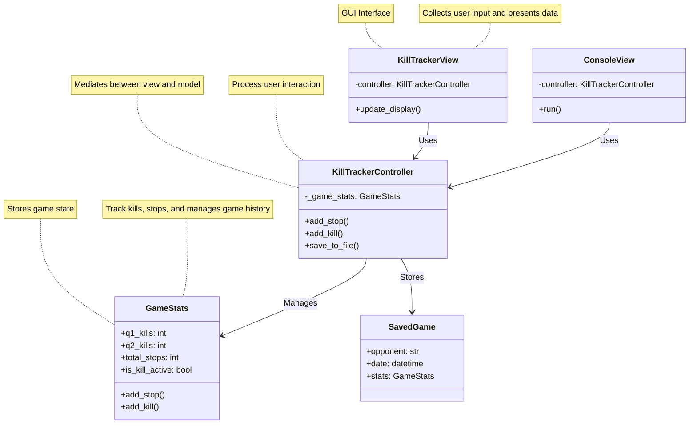

  

# Kill Tracker Final Project

## Project Overview

For my final project, I created an app designed to be used in basketball games to help coaches track defensive performance. Specifically, it tracks **kills**—which, in basketball terms, are defined as **three consecutive defensive stops**.

At Huntington Women's Basketball, our goal was to reach **10 kills per game**. Previously, we tracked this using paper, which was often messy and required manually counting defensive stops. This app simplifies the process by:

- Automatically tracking stops and kills in real time.
- Activating a "kill" once three consecutive stops are recorded.
- Displaying kills per quarter.
- Providing a game summary with total stops and kills after saving.

This app is intended for basketball coaches at all levels who want an organized way to monitor defensive effiency during games.

## Design & Architecture

I wanted this app to be very simple. When I first created the app, I was looking for ways to just track the kills. I had everything in one container tracking the amount of kills. As I continued, I realized that I wanted to split it up by quarters to make it easier and I wanted only 3 simple buttons to be able to add stops, add a kill, or reset because they scored. 

To build this app, I used a traditional MVC format. For the model, I had game_stats.py which is where the game data and logic is stored. For the view, I used kill_tracker_view.py. For the controller, I used Kill_Tracker_Controller. The controller is what coordinates the logic and updates the model.

## App Instructions 
For the construction of my app, I used Thonny. This allowed me just to use the MVC framework and then run main in order to get the app up and running. For the saving components, I wanted to save this as a json file where you can see the outline of the quarters and how many kills per each quarter. There is also another option to save it to the app and then there is a list of saved games where you can view each one. 

## Challenges, Role of AI, Insights 
When I first started this project, I created it all in dart and flutter. It looked great on the emulator and I loved the way it was working in Visual Studio Code. When I got to the saving aspect, I was able to save it inside the app, but I couldn't get it to save to my desktop. I also couldn't get the app to be able to read files in. My dream for this app is to be able to save it as a text file to your device and be able for the text file to be inputted while it also saves on the device as well. 

Because of the time of the project, I decided to completely scrap dart/flutter and had ChatGPT convert it over to python. When I got to this, I used the saving format that we had learned in class from P5 for the json file. I chose this saving because I like how it saved in a list and you could see each quarter. This was a lot easier than trying to figure out how dart/flutter was saving. 

For this project, I used ChatGPT, DeepSeek, GeeksForGeeks, and also our past class assignments. When I was trying to do it all in dart and flutter, I relied heavily on DeepSeek and ChatGPT with more of the syntax of the code. I understood the break up of the MVC format and how it was working but I wasn't quite their with the actual language and what all it meant. ChatGPT and DeepSeek were very helpful in breaking down the components and explaining what each class was doing and how it was all interacting. Python is a language that I have been coding in since I first begun taking computer science classes in high school. It is a language that I feel very confident in so when I had ChatGPT convert it to Python I had a better understanding of the workings of this app!

## Next Steps 
I really want to get this app up and running by the beginning of next school year because I think it would be very beneficial for me. There are two main steps that I have to figure out by then and those are: convert back to dart/flutter and figure out how to save to your actual device. I plan on working on this project throughout the summer and in my free time because I am very passionate on where I want it to be. Once I figure out the actual saving component, then I can put my app out there and actually use it! 

  

